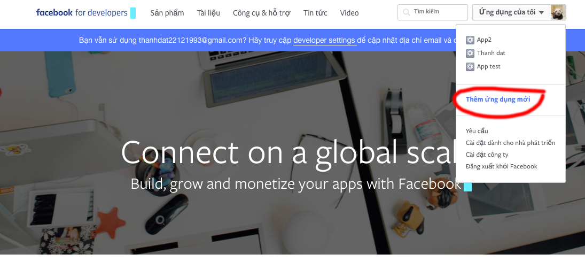
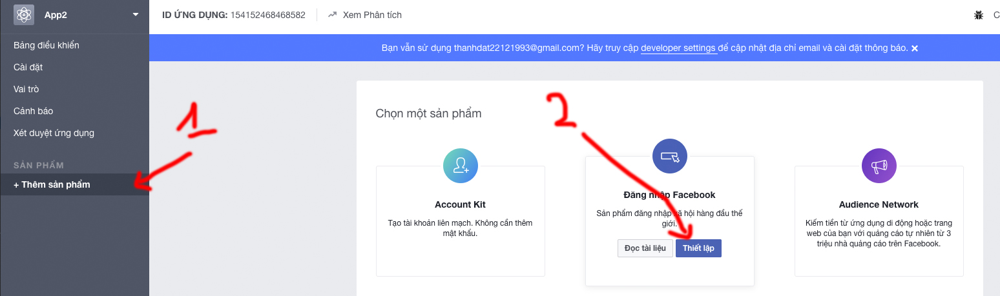
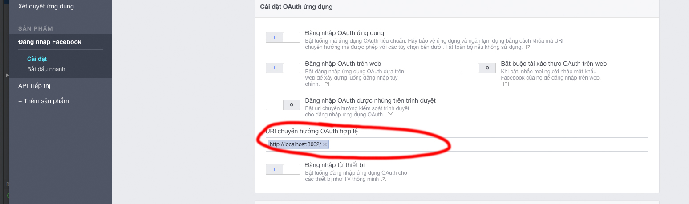
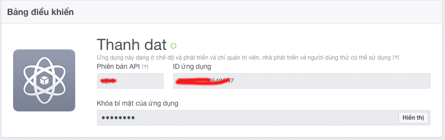
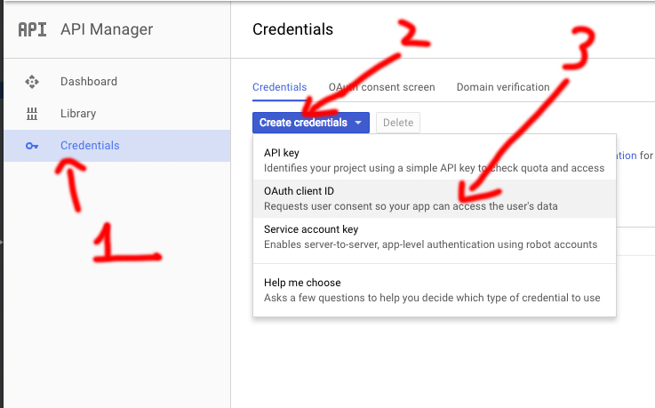
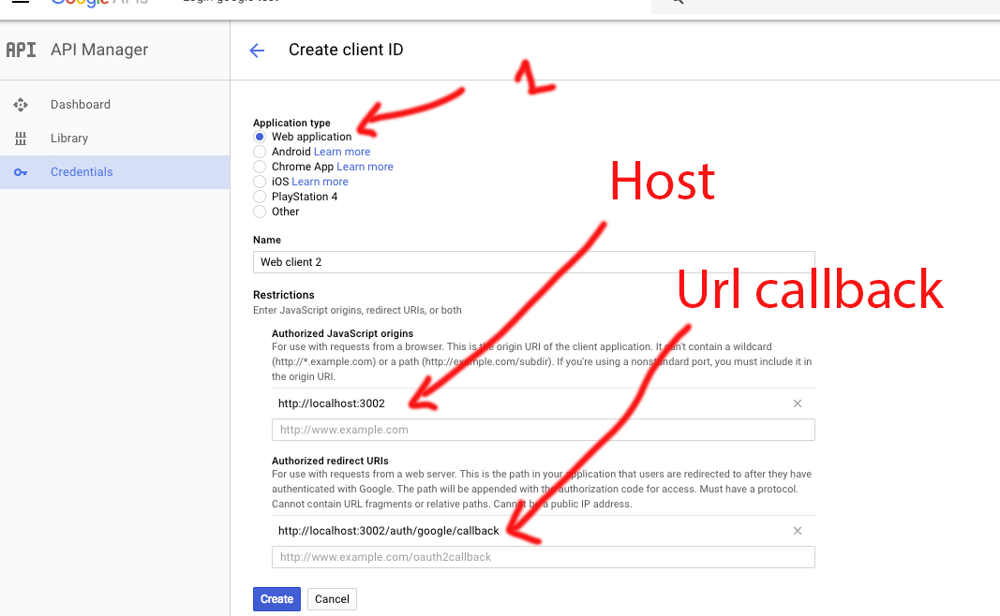
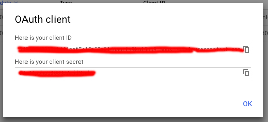
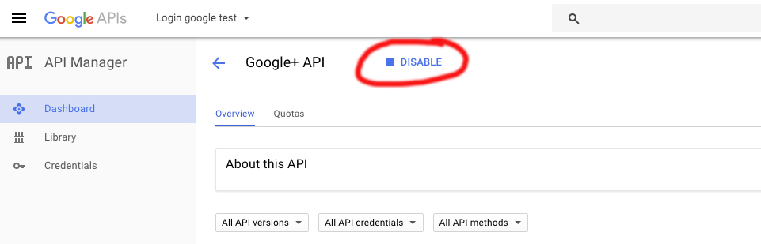

# User login Passport

## Cài đặt modules

```bash
npm i passport --save
.
//Sử dụng đăng nhập database
npm i passport-local --save
.
//Sử dụng đăng nhập facebook
npm i passport-facebook --save
.
//Sử dụng đăng nhập google
npm i passport-google-oauth --save
```
## Tạp app facebook, google để lấy SECRET key, API key

#### Facebook

1. Vào [facebook app](https://developers.facebook.com/) và tạo app



2. Thêm sản phẩm -> thiết lập đăng nhập facebook



3. Vao tab Cài đặt và điền domain. 



4. Lưu thay đổi

5. Vào 'Bảng điều khiển' để lấy App id vs Secret key



#### Google

1. Vào [Google app](https://console.developers.google.com/projectselector/apis/library)

2. chọn tab Credentials -> Create credentials -> OAuth client ID



3. Chọn 'Web application'



4. Click 'Create'

5. Khi tạo xong sẽ có API key và Secret key



6. Bật Google+ API

Library -> Google+ API



## Thảm khảo

[Passport authenticate](http://passportjs.org/docs/overview)

## Hướng dẫn

#### Giả data

```javascript
let userDB = [
    {
        id: 1,
        username: 'techmaster',
        password: '111'
    },
    {
        id: 2,
        username: 'docker',
        password: '123'
    },
]
```

#### Cài đặt chung

```javascript
const passport = require('passport');
.
// Đăng nhập local
const LocalStrategy = require('passport-local').Strategy;
.
// Đăng nhập facebook
const FacebookStrategy = require('passport-facebook').Strategy;
.
// Đăng nhập google sử dụng oAuth 2.0
const GoogleStrategy = require('passport-google-oauth').OAuth2Strategy;

app.use(passport.initialize()); // bắt buộc phải có để khởi tạo passport
app.use(flash());
app.use(passport.session()); 

//Dữ liệu ở serializeUser trả về và lưu vào session.passport
passport.serializeUser(function (user, done) {
    done(null, user);
});

//Dữ liệu ở deserializeUser trả về và lưu vào req.user
passport.deserializeUser(function (user, done) {
    console.log('deserializeUser', user)
    done(null, user);
});
```

### Đăng nhập local - từ database

##### 1. Hiển thị form login

Flash lưu thông báo khi đăng nhập thành công hoặc thất bại.
```javascript
app.get('/login', (req, res) => {
    let message = '';
    if (req.session.flash) {
        message = req.session.flash.error.length > 0 ? req.session.flash.error[0] : '';
    }
    req.session.flash = '';
    res.render('login', {message: message})
});
```

##### 2. Submit form thì gửi lên server, Mặc định là 'local'

```javascript
app.post('/login',
    passport.authenticate('local', {
        successRedirect: '/',
        failureRedirect: '/login',
        failureFlash: true
    })
);
```

##### 3. Cấu hình đăng nhập local

- Cách 1: Sử dụng mặc định thì name input sẽ trùng với username, password trong cấu hình

    ```html
    <input type="text" name="username" placeholder="Username">
    <input type="text" name="password" placeholder="Password">
    ```
    ```javascript
    passport.use(new LocalStrategy(
        function (username, password, done) {
            let checkUser = userDB.find(item => item.username == username && item.password == password)
            if(checkUser) {
                return done(null, checkUser.username);
            }else{
                return done(null, false, {message: 'Incorrect username or password.'});
            }
        }
    ));
    ```

- Cách 2: Custom name
   
   ```html
    <input type="text" name="email" placeholder="Username">
    <input type="text" name="pass" placeholder="Password">
    ```
    ```javascript
    passport.use(new LocalStrategy({
        usernameField: 'email',
        passwordField: 'pass',
    },
        function (email1, pass1, done) {
            let checkUser = userDB.find(item => item.username == email1 && item.password == pass1)
            if(checkUser) {
                return done(null, checkUser.username);
            }else{
                return done(null, false, {message: 'Incorrect username or password.'});
            }
        }
    ));
    ```
    
##### 4. Đăng nhập thành công

Khi đăng nhập xong thì passport sẽ lưu vào session

Hoặc hàm kiểm tra login của passport

``` javascript
req.isAuthenticated()
```

Có thể sử dụng để lưu session tùy chỉnh

```javascript
app.use((req, res, next) => {
    if (req.isAuthenticated()) {
        req.session.login = true;
        req.session.user = req.user;
    } else {
        req.session.login = false;
        req.session.user = {};
    }
    next();
});
```

##### 5. Đăng nhập facebook

Cấu hình route

```javascript
// callback từ facebook
app.get('/auth/facebook/callback',
    passport.authenticate('facebook', {
        successRedirect: '/',
        failureRedirect: '/login',
        failureFlash: true
    })
);

// Khi người dùng login facebook thì sẽ chạy route này và sẽ vào đăng nhập facebook
app.get('/login/facebook',
    passport.authenticate('facebook', { scope: ['email']}) // 
);
```

Cầu hình và xử lý dữ liệu facebook trả về

```javascript
passport.use('facebook', new FacebookStrategy({
        clientID: 'FACEBOOK_APP_ID',
        clientSecret: 'FACEBOOK_APP_SECRET',
        callbackURL: "http://example.com/auth/facebook/callback",
        profileFields: ['id', 'emails', 'name'] // Dữ liệu trả về. Mặc định ko trả về email nên ta thêm emails vào.
    },
    function (accessToken, refreshToken, profile, done) {
        // profile sẽ lưu thông tin lấy từ facebook về
        // Nhớ dùng: return done(...) để dữ liệu đc trả về
    }
));
```

Dữ liệu facebook trả về nếu thành công

```
{ id: '...',
  username: '...',
  displayName: '...',
  name: { familyName: 'Đạt', givenName: 'Nguyễn', middleName: 'Thành' },
  gender: '...',
  profileUrl: '...',
  emails: [ { value: '...' } ],
  provider: 'facebook',
  _raw: '...',
  _json: 
   { id: '...',
     email: '...',
     last_name: 'Đạt',
     first_name: 'Nguyễn',
     middle_name: 'Thành' } }
```

##### 6. Đăng nhập google

Cấu hình route

- Có nhiều kiểu dữ liệu trả về. [xem thêm](https://developers.google.com/+/web/api/rest/oauth)


```javascript
app.get('/login/google',
    passport.authenticate('google', { scope: ['https://www.googleapis.com/auth/userinfo.email'] }));

app.get('/auth/google/callback',
    passport.authenticate('google', { failureRedirect: '/login' }),
    function(req, res) {
        res.redirect('/');
    });
```

Cấu hình và xử lý dữ liệu google trả về

```javascript
passport.use(new GoogleStrategy({
    clientID: '64980042356-kn2mqkp84a405aim3ufs8rvd0vragm1q.apps.googleusercontent.com',
    clientSecret: '0GEJOVWD2KGN6ty1yCzVe2fa',
    callbackURL: "http://localhost:3001/auth/google/callback"
  },
  function(accessToken, refreshToken, profile, done) {
       // profile sẽ lưu thông tin lấy từ google về
        // Nhớ dùng: return done(...) để dữ liệu đc trả về
  }
));
```

Đăng nhập google sẽ trả về dữ liệu:

```
{ id: '...',
  displayName: 'Đạt Nguyễn Thành',
  name: { familyName: 'Nguyễn Thành', givenName: 'Đạt' },
  emails: [ { value: 'example@gmail.com', type: 'account' } ],
  photos: [ { value: '...' } ],
  gender: '...',
  provider: 'google',
  _raw: '...',
  _json: 
   { kind: 'plus#person',
     etag: '...',
     gender: '...',
     objectType: 'person',
     id: '...',
     displayName: 'Đạt Nguyễn Thành',
     name: { familyName: 'Nguyễn Thành', givenName: 'Đạt' },
     url: 'https://plus.google.com/110653217815824410910',
     image: 
      { url: '...',
        isDefault: false },
     placesLived: [ [Object] ],
     isPlusUser: true,
     language: '...',
     ageRange: { min: ... },
     circledByCount: ...,
     verified: false } }
```

### Kết luận

Sau khi có dữ liệu trả về rồi thì có hàm để kiểm ktra login hay chưa. 

```javascript
req.isAuthenticated()
```
Passport sẽ tự lưu biến user ở serializeUser và deserializeUser vào session

```javascript
req.session
req.user
```